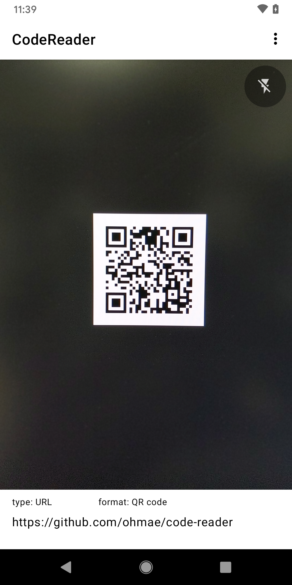
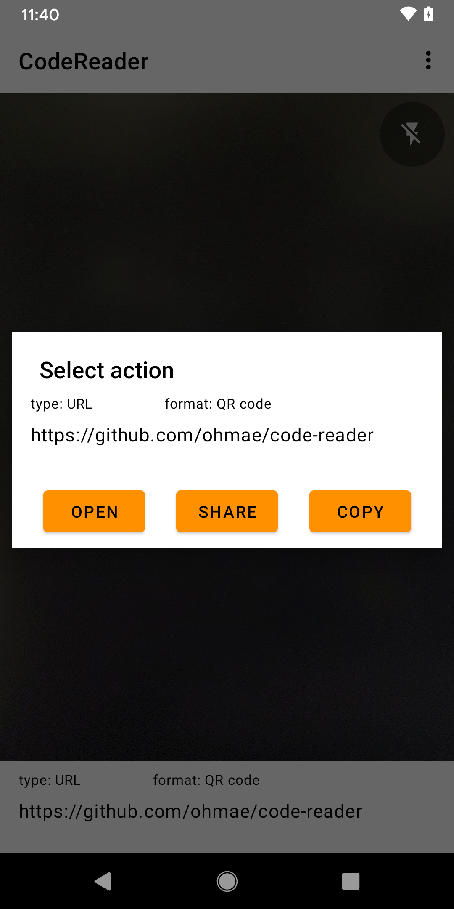

# Code Reader

This is a simple code reader app by ML Kit and CameraX.

## ScreenShots

|||
|:-:|:-:|
|||

## Author

大前 良介 (OHMAE Ryosuke)
http://www.mm2d.net/

## License

[MIT License](./LICENSE)
