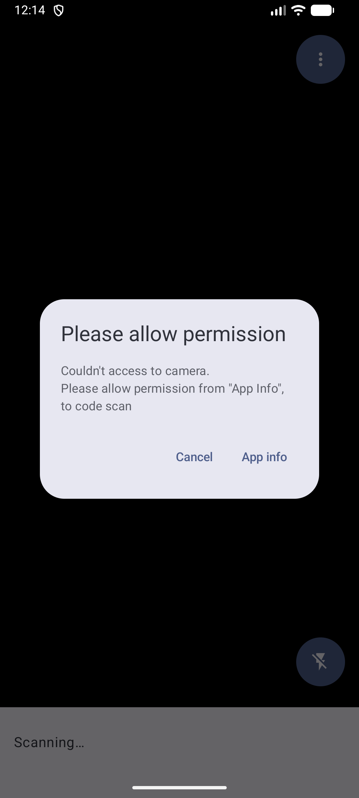

# 検出演出・権限ダイアログの Compose 移行記録

実装・検証日: 2026-10-10。移行計画の段階 7。

## 検出演出

`DetectedPresenter` と `DetectedMarkerView` を削除し、`DetectionOverlay` の `Image` と
`Canvas` に置き換えた。CameraX の `PreviewView` だけは引き続き `AndroidView` に残す。
検出コールバック中に `DetectedFrame` へ Bitmap、角点、フレーム寸法、回転をコピーする。
`ImageProxy` と `Barcode` は Compose の状態に保持しない。
フレームを閉じる責務は既存の `CodeAnalyzer` に残し、ML Kit の完了後に閉じる。

Bitmap の回転補正と center crop、枠の中心を基準にした 4→1.2 倍の縮小を維持した。
`DetectionTransform` は ML Kit の回転済み角点へ center crop を適用する純粋ロジック。
演出は既存の DecelerateInterpolator(3) と同じイージングで 1 秒、続けて 0.5 秒待機し、
表示を消して読取りを再開する。枠の色は共通の dynamic color 対応テーマから取得する。

演出の完了・キャンセルでは同じ終了処理を行う。古いフレームの終了処理が新しい演出を
消さないようにフレームの同一性を確認する。Activity の停止と View の解放でも演出を消し、
解析の pause 状態を解除する。停止中に届いた解析結果は新しい演出を開始しない。
表示 Bitmap は手動で recycle せず、描画側の参照とともに GC に任せる。
回転用の一時 Bitmap だけは表示前に解放する。

## 権限 UI

旧 `PermissionDialog` を削除し、Material 3 の `CameraPermissionDialog` に置き換えた。
文言、アプリ情報へのリンク、キャンセル時のエラー終了を維持する。
既存の Activity Result 登録と `PermissionRequestLauncher` の拒否判定は変更していない。

ダイアログ表示と未完了の権限要求を Activity の保存状態に含め、回転・再生成時の
要求の重複を防ぐ。権限要求は初回処理からのみ行い、再コンポーズで要求しない。
`onRestart` ではカメラ開始済みでも権限を再確認し、未許可ならエラー終了する。

## 検証

- `:app:assembleDebug`、`:app:testDebugUnitTest`、`:app:lintDebug`、`ktlint` を実行。
  単体テストは既存 24 件と追加 11 件、計 35 件が成功。ktlint の違反出力も確認した。
- Lint エラーは 0 件。既存の依存関係更新候補 2 件と未使用の `orange_500` の警告は残る。
- 座標テストで 90/270 度の寸法補正、縦横の center crop、枠の中心からの拡縮を確認。
- Native Graphics の Bitmap テストで 0/90/180/270 度の寸法・実ピクセルの回転と、
  演出側が `ImageProxy.close()` を呼ばないことを確認。
- Compose UI テストで 1 秒の演出と 0.5 秒の待機、途中での表示終了、古い演出の完了、
  Bitmap を recycle しないこと、終了時に一度だけ再開することを確認。
- Activity の停止・復帰と CameraPreviewView の解放で演出が残らないことを確認。
- 権限ダイアログのボタン通知と、権限要求中の `ActivityScenario.recreate()` で要求を
  追加しないことを確認。ランナーと Activity 操作は AndroidX Test を使用する。
  権限取消しと要求履歴の取得には対応 API がないため、そこだけ Robolectric の Shadow を使う。

API 37 エミュレータで初回のシステム要求、通常の拒否による終了、再要求できない場合の
Compose ダイアログ、アプリ情報への遷移、設定画面での許可後に元の Activity へ戻った際の
カメラ再開、ダイアログの回転後の復元を確認した。
カメラ権限を adb で取り消すとプロセスが終了し、再起動後に権限 UI が表示されることも確認した。
検証後は回転と権限を元の状態に戻し、仮想シーンに設定した検証画像も解除した。

実機でのバーコード検出・枠の追従・静止画像との重なり・演出終了後の連続読取りは未確認。
仮想シーンの QR ポスターはカメラの視野に入らず、エミュレータでこれらの実写確認はできなかった。
日本語、ダークテーマ、大きなフォント、TalkBack、3 ボタンナビゲーション、IDE Preview の
手動確認も今回には含まない。依存関係は変更していない。

## 権限画面

## 参照

ML Kit の座標は回転補正済みの解析画像を基準にする。
[公式の座標系説明](https://developer.android.com/reference/androidx/camera/mlkit/vision/MlKitAnalyzer)を参照。
演出の取消し処理は
[Compose の副作用 API](https://developer.android.com/develop/ui/compose/side-effects)に合わせて実装した。
