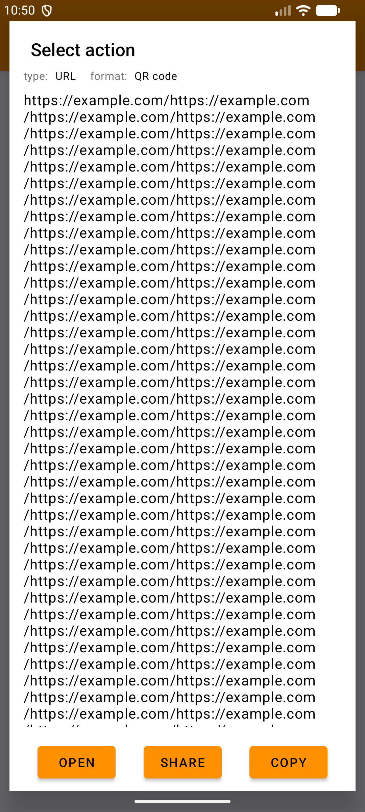
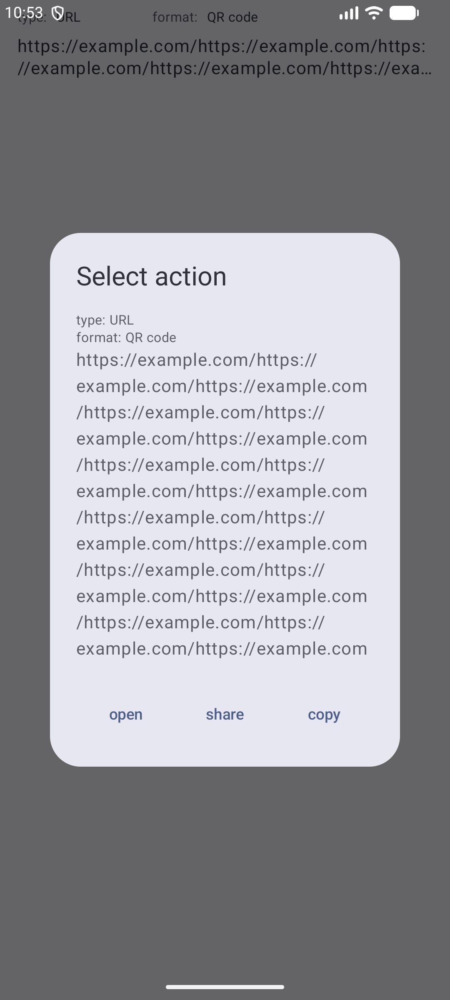
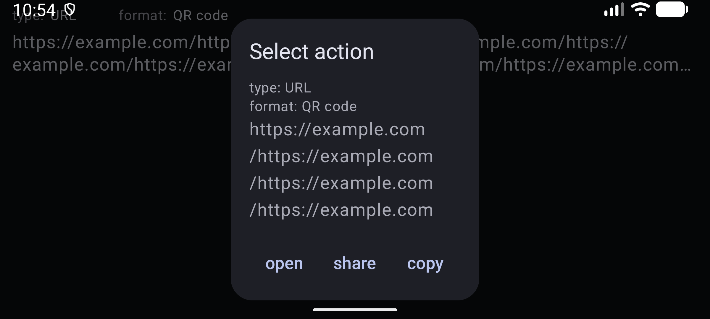

# 結果ダイアログの Compose 移行記録

確認日: 2026-10-10。移行プランの段階 5 を実装した。

## 実装

結果一覧と選択状態を `ScanResultContent` にまとめ、Material 3 の `AlertDialog` で結果を表示する。
`AppTheme` の Dynamic Color / 標準カラースキームを利用し、アプリ固有の色指定は追加していない。
種別・形式・値を表示し、長文の本文は縦スクロールできる。開く・共有・コピーのボタンは本文の外に固定する。

選択した `ScanResult` は Parcelable と `rememberSaveable` により保存する。
Activity 再生成時はダイアログだけを復元し、外部起動・コピー・レビュー回数の加算は実行しない。
操作時は選択を同期的に解除してからコールバックを呼ぶため、同じ表示に対する操作の再実行を防ぐ。
戻る・外側タップは選択を解除するだけで、アクションを実行しない。

開く・コピー・共有は MainActivity から既存の `Launcher` / `ClipboardUtils` を呼ぶ。
URI を開けない場合の検索フォールバック、コピーの種別ラベル、共有の chooser、
各操作での `ReviewRequester.onAction()` を維持した。
カメラ・解析・検出演出・一覧の拡張には変更を加えていない。
旧 DialogFragment と `dialog_result.xml` は削除した。依存関係と文字列リソースは変更していない。

## 自動検証

- `./gradlew :app:assembleDebug`: 成功。
- `./gradlew :app:testDebugUnitTest`: 全17件成功。
- `./gradlew :app:lintDebug`: 成功。既存依存の更新通知2件と `orange_500` 未使用警告のみ。
- `./gradlew ktlint`: 成功。出力にスタイル違反なし。
- `git diff --check`: 成功。

AndroidJUnit4 / ActivityScenario と Compose UI Test を使い、3操作がそれぞれ一度だけ呼ばれて
ダイアログが閉じること、長い本文がスクロールでき操作ボタンが見えることを確認した。
MainActivity のテストでは、選択状態の再生成、復元時の非再実行、実際のクリップボードのラベル・本文、
レビュー回数の一度だけ加算、操作後の再生成で閉じたままになること、次の結果を選択できることを確認した。
既存の一覧スクロール復元テストも成功した。Robolectric 固有の API は `@Config` のみ。

## エミュレータ確認と制約

API 37 の一時検証用 Activity に長い結果を表示し、旧・新ダイアログを比較した。
この Activity と Manifest の追加は検証後に削除している。
英語のライト・縦画面と、ダーク・横画面・文字サイズ150%で本文と3操作が表示されることを確認した。
長文スクロール、戻る操作、外側タップによる閉鎖も確認した。

検証用 Activity の操作コールバックは空のため、外部アプリへの起動と共有 chooser の端末操作は未確認。
コピーの実処理は MainActivity のユニットテストで確認した。
実カメラからの読み取り、ダイアログを閉じた後の実カメラによる読み取り、日本語表示、TalkBack、
3ボタンナビゲーション、プロセス終了後の再生成、IDE での Preview 描画は未確認。
結果一覧の永続化は追加していない。

| 旧実装: 長文・ライト | Compose: 長文・ライト |
| --- | --- |
|  |  |

