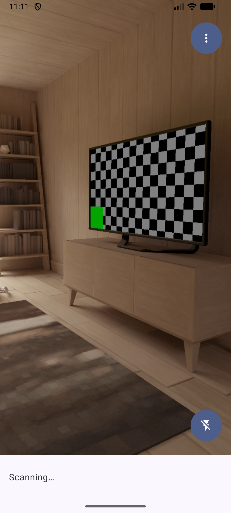
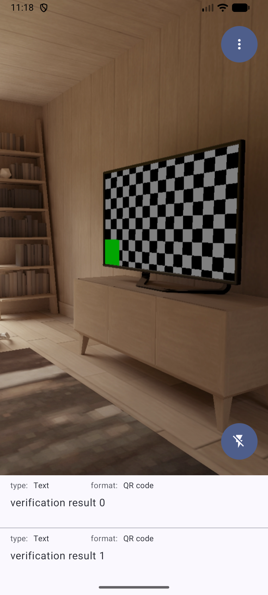
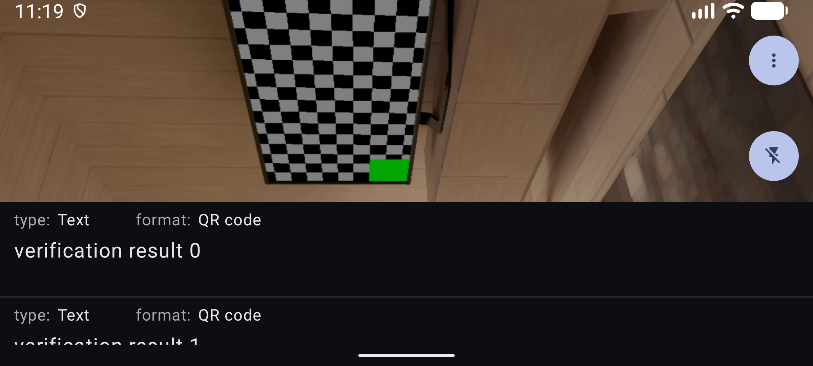

# メイン画面の Compose 移行記録

実装・検証日: 2026-10-10。移行計画の段階 6。

## 実装

`MainActivity` を `setContent` に切り替え、結果一覧、読取中表示、メニュー、トーチを
`MainScreen` にまとめた。権限、アップデート、レビュー、結果の保存と操作は既存の処理を維持する。
色は共通の `AppTheme` を使い、対応端末では dynamic color、その他ではカスタマイズしない
Material 3 の light/dark color scheme を使う。

カメラは `AndroidView` の `CameraPreviewView` に残した。`PreviewView`、静止画像、検出枠を
同じ領域に重ね、`CodeScanner` と `DetectedPresenter` はこの View ごとに保持する。
結果が 0/1 件なら一覧の表示領域は 80dp、2 件以上なら 160dp にアニメーションで拡張する。
トーチも一覧に合わせて移動するが、カメラの領域は拡張前後で変わらない。
上部の映像はステータスバーの背後まで表示し、操作ボタンだけを避ける。
左右と下部の system bars の Insets は外側で一度適用する。

View の解放は `AndroidView.onRelease` で行う。Scanner の解放は冪等とし、Lifecycle Observer、
Analyzer、カメラの使用中の UseCase、SurfaceProvider、Executor を解放する。
非同期の CameraProvider 取得が解放後に完了しても再接続しない。
解析中に解放された場合は結果通知を止め、処理中の `ImageProxy` を ML Kit の完了後に閉じてから
ML Kit Scanner を閉じる。Presenter の終了済みアニメーションからの解析再開も防止する。

旧 `activity_main.xml`、`OptionsMenuPresenter`、カメラボタン専用の背景を削除した。
依存関係は変更していない。検出演出の Compose 化は段階 7 で行う。

## 検証

- `:app:assembleDebug`、`:app:testDebugUnitTest`、`:app:lintDebug` を実行。
  単体テストは既存 17 件と追加 7 件、計 24 件。
- `ktlint` は終了コードに加えて違反出力を確認。
- Lint エラーは 0 件。既存の依存関係更新候補 2 件と未使用の `orange_500` の警告は残る。
- Compose UI テストで 0→1→2 件の一覧、カメラ領域の維持、トーチの移動、操作コールバック、
  メニューの選択・閉じる動作を確認した。
- 解析テストで成功・失敗・処理開始時の例外と、処理中の解放時のフレーム・Scanner の終了順を確認した。
- Scanner テストで開始・解放の重複呼び出し、Observer の解除、解放後の非同期完了を確認した。
  ランナーと Activity 操作は AndroidX Test を使う。

API 37 エミュレータで 0/1/2 件、メニューから設定とその復帰、横画面、ダークテーマ、
フォント倍率 1.5 を確認した。1/2 件の撮影には一時的に結果を投入するデバッグ処理を使い、
確認後に削除した。エミュレータのフォント・回転・テーマ設定も戻した。
CameraService の接続は表示中 1 件、バックグラウンドで 0 件、復帰後 1 件となった。

実機でのバーコード検出、静止画像と検出枠の位置、トーチの実際の点灯は未確認。
日本語表示、TalkBack、3 ボタンナビゲーション、IDE 上の Preview も今回の手動確認には含まない。
カメラの実写動作の確認は引き続き必要。

## 画面

| 0 件・ライト | 1 件・ライト | 2 件・ライト |
| --- | --- | --- |
|  |  |  |

