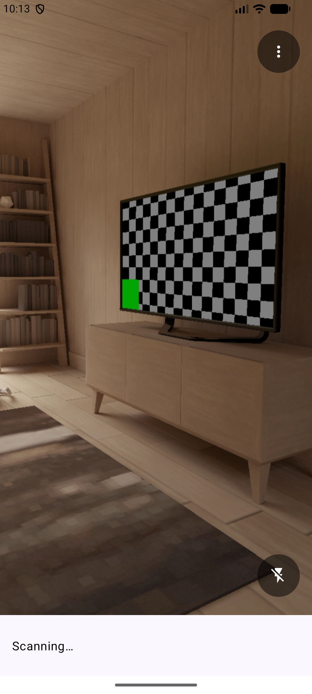

# 結果一覧の Compose 移行記録

確認日: 2026-10-07。移行プランの段階 4 を実装した。

## 実装

メイン画面の RecyclerView を、同じ `result_list` ID と制約を持つ ComposeView に置き換えた。
`DisposeOnViewTreeLifecycleDestroyed` で Composition を Activity のライフサイクルへ結び付け、
親 View が適用する Insets を一覧へ二重に適用しないようにした。
カメラ・検出演出・メニュー・フラッシュ・scanning 表示と、dummy / ValueAnimator による拡張は維持する。

一覧は `AppTheme` と `LazyColumn` を使用し、StateFlow を `collectAsStateWithLifecycle` で購読する。
種別・形式・最大2行の値・区切り線・行全体の選択を維持し、通常の行高を80dpに合わせた。
フォント拡大時は行高を増やせるようにした。
選択後は既存の `ScanResultDialog.show()` を呼び出す。

`ScanResult` 全体を Parcelable キーとして使用するため、値が同じでも他のフィールドが違う結果を区別する。
ViewModel の追加順・全フィールドによる重複排除は変更していない。
保存可能な件数と LazyListState を使用し、新規追加時だけ末尾へスクロールする。
回転後や新しい追加がない場合は、ユーザーのスクロール位置を維持する。

0件・1件・複数件・長い値の Preview を追加し、旧 `ScanResultAdapter` と `item_result.xml` を削除した。
依存関係は変更していない。

## 自動検証

- `./gradlew :app:assembleDebug`: 成功。
- `./gradlew :app:testDebugUnitTest`: 全15件成功（今回追加6件）。
- `./gradlew :app:lintDebug`: 成功。既存の `orange_500` 未使用警告のみ。
- `./gradlew ktlint`: 成功。出力にスタイル違反なし。
- `git diff --check`: 成功。

ViewModel の追加順・完全一致の重複排除・各フィールドの相違を検証した。
AndroidJUnit4 / ActivityScenario により、同じ値で形式の異なる行の選択、長い値、
0件からの追加、追加時だけのスクロール、既存ダイアログの表示、Activity 再生成後の位置維持を確認した。
MainActivity のユニットテストでは ML Kit の初期化 Provider を明示的に起動する。
Robolectric 固有 API は SDK / Application 設定の `@Config` のみ。

## エミュレータ確認と制約

API 37 エミュレータでカメラプレビューと0件の画面表示を確認した。
[移行前の0件画面](../compose-baseline/main-light-en-portrait.png) と比較し、
プレビュー・メニュー・フラッシュ・一覧の占有領域を維持していることを確認した。
結果一覧の背景は Dynamic Color の Material 3 Surface に変更した。

仮想シーンに QR ポスターを配置したがカメラの視野外にあり、今回の実機・エミュレータでの
実際の読取りから一覧への追加、検出演出、複数件による拡張アニメーションは未確認。
一覧追加・選択・ダイアログへの接続・回転復元は MainActivity の統合テストで確認した。
IDE での Preview 描画も未確認。

